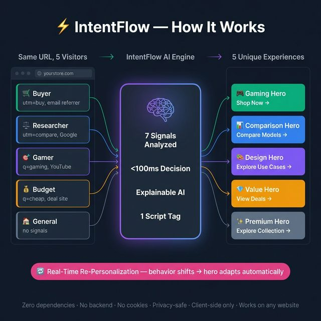
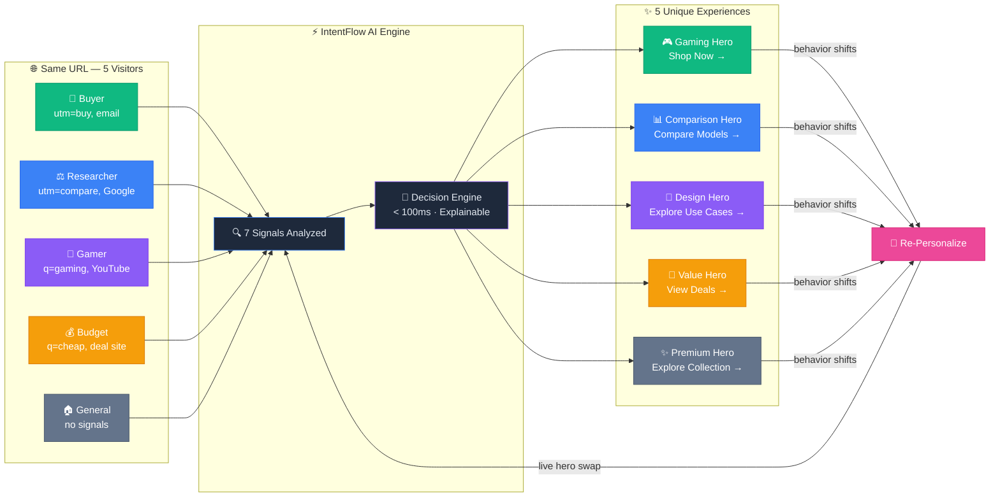

# ⚡ IntentFlow

**Plug-and-play AI personalization for any website — in a single script tag.**

IntentFlow detects visitor intent from context signals (UTM parameters, referrer, behavior) and instantly personalizes your hero section with the optimal template, image, headline, and CTA. No backend required. No complex setup. Just paste one snippet.


---

## 🎯 What It Does

| Feature | Description |
|---|---|
| **7-Signal Intent Detection** | Analyzes URL/UTM params, referrer, behavior, persona toggle, device type, time of day, and screen size to determine visitor intent |
| **Smart Decision Engine** | Rules-based AI selects the best hero template, image, and CTA from a finite registry — with full explainability |
| **DOM Injection** | Safely swaps hero content with smooth fade transitions; auto-fallback to default on error |
| **Mid-Session Re-Personalization** | Real-time behavioral observer adapts the hero DURING the visit based on scroll, click, and hover patterns |
| **3 Hero Templates** | Impact (buy), Comparison (research), Value (budget) — each with distinct layouts optimized for different intents |
| **6 Asset Variants** | Gaming, office, creative, budget, comparison, and default hero images |
| **Debug Overlay** | "Why this variant?" panel showing detected intent, confidence, signals, and full decision JSON |
| **Preview Mode** | Site-owner panel to simulate all intents and see variants live |
| **Event Tracking** | Lightweight client-side analytics for impressions, CTA clicks, and variant swaps |
| **A/B Exploration** | Randomly split visitors between 2 content variants per intent, track CTR, and auto-pick the winner |
| **Multi-Page Support** | Personalize heroes on homepage, product pages, category pages, and landing pages with page-aware content |
| **Conversion Analytics** | Dashboard with conversion funnel, intent distribution, signal breakdown, and ROI projections |

---

## 🚀 Quick Start (< 5 Minutes)

### 1. Paste one script tag

```html
<!-- Single script tag — that's all you need -->
<script src="intentflow.bundle.js"></script>
```

### 2. Mark your hero section

```html
<section data-intentflow-hero data-intentflow-assets="assets/">
  <!-- Your default hero content (shown as fallback) -->
  <h1>Welcome to our store</h1>
  <a href="#shop">Shop Now</a>
</section>
```

### 3. Done ✅

IntentFlow auto-initializes on page load, detects visitor intent from context signals, and swaps in the optimal hero variant with a smooth transition. If anything fails, your default content is preserved.

> **Modular install** — For advanced setups, load individual modules instead:
> ```html
> <script src="sdk/engine/intent-detector.js"></script>
> <script src="sdk/engine/decision-engine.js"></script>
> <script src="sdk/engine/event-tracker.js"></script>
> <script src="sdk/engine/context-observer.js"></script>
> <script src="sdk/ui/injector.js"></script>
> <script src="sdk/ui/debug-overlay.js"></script>
> <script src="sdk/ui/preview-mode.js"></script>
> <script src="sdk/intentflow.js"></script>
> ```

---

## ⚡ How It Works

> **Same URL → 5 different visitors → 5 personalized experiences**



<details>
<summary>View Mermaid source (interactive on GitHub)</summary>



</details>

**1 script tag · Zero dependencies · No backend · No cookies · Privacy-safe · Client-side only**

<details>
<summary>📋 Module Reference</summary>

| Module | File | Role |
|---|---|---|
| Intent Detector | `intent-detector.js` | 7-signal intent classification |
| Decision Engine | `decision-engine.js` | Template + asset selection with explainability |
| DOM Injector | `injector.js` | Safe hero swap with transitions + fallback |
| Context Observer | `context-observer.js` | Mid-session re-personalization from behavior |
| Event Tracker | `event-tracker.js` | Lightweight client-side analytics |
| A/B Explorer | `ab-explorer.js` | Random variant split + auto-winner selection |
| Multi-Page | `multi-page.js` | Page-aware personalization (product, category, landing) |
| Debug Overlay | `debug-overlay.js` | "Why this variant?" developer panel |
| Preview Mode | `preview-mode.js` | Site-owner variant preview |
| Registry | `templates.json` + `assets.json` | 3 templates, 6 images, 5 content variants |

</details>

---

## 📊 Decision Object (Explainability)

Every personalization decision outputs a structured JSON object:

```json
{
  "intent": "COMPARE",
  "confidence": 0.92,
  "template": "hero-comparison",
  "templateName": "Comparison Hero",
  "hero_image": "assets/hero-comparison.png",
  "headline": "Find Your Perfect Match",
  "subheadline": "Side-by-side specs, real benchmarks, and honest reviews.",
  "cta_text": "Compare Models →",
  "cta_link": "#shop",
  "badges": [
    { "icon": "🏆", "label": "Top Rated" },
    { "icon": "🛡️", "label": "3-Year Warranty" },
    { "icon": "✅", "label": "4K Certified" }
  ],
  "reason": "Detected intent: COMPARE (confidence: 92%) from 2 signal(s): utm_campaign(utm_campaign=\"comparison\"), referrer(document.referrer=\"google.com/search\"). Template \"Comparison Hero\" is optimized for COMPARE intent.",
  "signals_used": ["utm_campaign", "referrer"],
  "engine_version": "1.0.0"
}
```

---

## 🧪 Try the Demo

### Run locally

```bash
# Clone the repository
git clone https://github.com/yatrinn/intentflow.git
cd intentflow

# Open the demo (no build step required!)
open demo/index.html
```

### Test different intents

| URL Parameter | Intent | Hero Variant |
|---|---|---|
| `?intent=buy_now` | BUY_NOW | Gaming hero + "Shop Now" CTA |
| `?intent=compare` | COMPARE | Comparison hero + "Compare Models" CTA |
| `?intent=use_case` | USE_CASE | Design studio hero + "Explore by Use Case" CTA |
| `?intent=budget` | BUDGET | Value hero + "View Deals" CTA |
| `?intentflow_debug=true` | — | Shows debug overlay |
| `?intentflow_preview=true` | — | Shows preview mode panel |
| `?intentflow_ab=true` | — | Enables A/B exploration (random variant split) |

### Multi-page personalization

Add `data-intentflow-page` to hero sections on different page types:

```html
<!-- Product page -->
<section data-intentflow-hero data-intentflow-page="product">

<!-- Category page -->
<section data-intentflow-hero data-intentflow-page="category">

<!-- Landing page -->
<section data-intentflow-hero data-intentflow-page="landing">
```

Or use the **persona toggle bar** at the top of the demo page to switch intents live.

---

## 📁 Project Structure

```
intentflow/
├── README.md                    # This file
├── LICENSE                      # MIT License
├── package.json                 # Project metadata
├── docs/
│   ├── one-page-report.md       # 1-page structured report
│   └── project-summary.txt      # 150-300 word pitch
├── sdk/                         # Core SDK (the product)
│   ├── intentflow.bundle.js     # ⚡ Single-file bundle (all-in-one)
│   ├── intentflow.js            # Main entry point (modular)
│   ├── engine/
│   │   ├── intent-detector.js   # 7-signal intent detection
│   │   ├── decision-engine.js   # Explainable template selection
│   │   ├── event-tracker.js     # Lightweight analytics
│   │   ├── ab-explorer.js       # A/B variant exploration
│   │   └── context-observer.js  # Real-time behavioral re-personalization
│   ├── registry/
│   │   ├── templates.json       # 3 hero template definitions
│   │   └── assets.json          # Asset library (images, badges, content)
│   └── ui/
│       ├── injector.js          # Safe DOM mutation
│       ├── debug-overlay.js     # "Why this variant" overlay
│       ├── preview-mode.js      # Site-owner preview panel
│       └── multi-page.js        # Multi-page personalization
├── demo/                        # Demo store (monitors e-commerce)
│   ├── index.html               # Polished storefront
│   ├── analytics.html           # Conversion analytics dashboard
│   ├── styles.css               # Premium dark-mode design
│   ├── demo.js                  # Persona toggle + event log
│   └── assets/                  # Hero images (6 variants)
└── tests/
    └── test-engine.html         # Browser-based test harness (48 tests)
```

---

## 💡 Intent Taxonomy

| Intent | Trigger Signals | Example URL |
|---|---|---|
| `BUY_NOW` | "buy", "purchase" in query; email referrer; desktop device; evening hours | `?q=buy+4k+monitor` |
| `COMPARE` | "compare", "vs", "best" in query; Google/Reddit referrer; fast scrolling | `?utm_campaign=comparison` |
| `USE_CASE` | "gaming", "design", "coding" in query; YouTube referrer; business hours; 4K screen | `?q=monitor+for+gaming` |
| `BUDGET` | "cheap", "budget", "under" in query; deal sites referrer; late night; small viewport | `?q=cheap+144hz+monitor` |
| `DEFAULT` | No strong signals detected | (no params) |

---

## 🔑 Key Design Decisions

1. **Client-side only** — No backend, no API calls, no latency. Everything runs in the browser.
2. **Finite templates** — Safe, predictable personalization from a curated registry (not generative AI).
3. **Graceful fallback** — If anything fails, the original default content is preserved.
4. **Explainable** — Every decision includes a human-readable explanation and full signal breakdown.
5. **Zero dependencies** — Pure vanilla JavaScript. No frameworks, no build tools.
6. **Real-time adaptation** — Behavioral observer re-personalizes mid-session based on actual user actions.
7. **Privacy-safe** — All context signals (device, time, screen) use privacy-respecting browser APIs. No cookies, no fingerprinting.

---

## 📜 License

MIT License — see [LICENSE](LICENSE) for details.

---

## 🏆 Built for

**4th Hack-Nation Global AI Hackathon 2026**  
Challenge: *Plug-And-Play Dynamic Website — Automated, dynamic website based on third party user data*

Built by **Yannik Trinn** · [GitHub](https://github.com/yatrinn)
